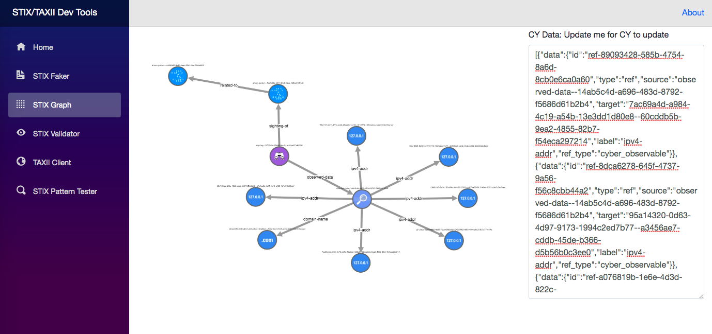

# STIX-TAXII-DevTools

A set of development tools for supporting STIX and TAXII spec and implementation development.

This project is development tooling is a continuous work in progress.

Supporting libraries:

- https://github.com/StephenOTT/STIX-Java
- https://github.com/StephenOTT/TAXII-springboot-bpmn
- https://github.com/StephenOTT/STIX-Faker
- https://github.com/StephenOTT/STIX-Validator

-----

STIX icons used in Network Graph visualization tooling is from: https://github.com/freetaxii/stix2-graphics from the work of Bret Jordan.  See applicable licensing from that repo.

